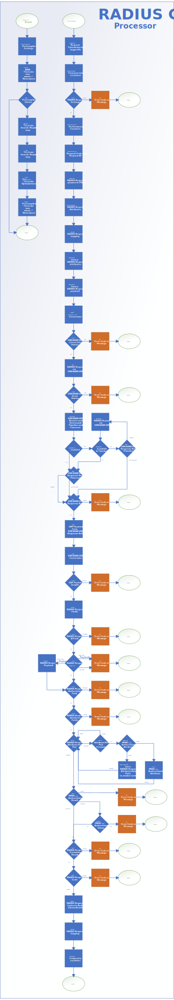

# Introduction
The iRule based RADIUS Client Stack can be used to perform RADIUS based user authentication via SIDEBAND UDP connections. The RADIUS Client Stack covers the RADIUS protocol core-mechanics outlined in [RFC 2865](https://tools.ietf.org/html/rfc2865) and [RFC 5080](https://tools.ietf.org/html/rfc5080) and can be utilized for a Password Authentication Protocol (PAP) authentication without requiring an APM-Addon license.

***Note:** The provided RADIUS Client Stack could be also useful for APM based deployments if the use of HMAC-based Authencator values is mandatory for your environment or if you need more control of the RADIUS request/response attributes or granular RADIUS request retransmits and RADIUS response timeouts are required. Especially in cloud based 2FA RADIUS scenario (e.g. Microsoft Azure MFA) you will notice improved reliability by sending a couple RADIUS request retransmits at the beginning of the RADIUS conversation and then simply wait for the RADIUS response up to 60 seconds to allow the user to accept any push notifications or to answer the incoming phone call.*

# Design of the iRule based RADIUS Client Stack
The design goal of the RADIUS Client Stack was to simplify its execution as much as possible, so that integrators of this iRule don't need to be experts of the RADIUS protocol specification or full time TCL developers. All you need to know is how to set up the configuration parameters to craft a RADIUS authentication request, how to execute the RADIUS Client Stack and how to evaluate the results of the RADIUS responses.

The RADIUS Client Stack is implemented by loading and storing TCL script code into global accessible variables within the `$static::*` namespace. This step is performed by the provided iRule using a `RULE_INIT` event. The TCL script code stored in the global accessible `$static::*` variables can later be accessed and `[eval]` executed by any other iRule stored on the same device.

***Note:** If you have never worked with the `[eval]` command, then simply think of a classic macro recorder that stores and loads a TCL script to/from a `$static::*` variable, which is then inserted and executed at a given position of your custom iRule which needs to perform a RADIUS Client authentication. It’s kind of a TCL procedure, only more in-line to the TCL code which has called the TCL macro code.*

The iRule sample below outlines how the RADIUS Client Stack can be `[eval]` executed from one of your iRule solutions. The provided sample contains a RADIUS Server configuration section (to assign certain RADIUS Server specific configuration options), a RADIUS request section (to set the username, password and optional RADIUS request attributes), the `[eval]` execution of the RADIUS Client Stack module and finally a RADIUS response section (to evaluate the outcome of the RADIUS response).

```
#####################################################
# RADIUS Server configuration

# RADIUS Server IP:Port or Virtual Server name
set server_config(address)	"192.168.0.1:1812"

# RADIUS shared secret
set server_config(shared_key)	"MySecureSharedKeyString"

# RADIUS response timeout in milliseconds
set server_config(timeout)	5000

# List of RADIUS retransmit timers in milliseconds
set server_config(retransmits)	"100 200 400 800"

#####################################################
# RADIUS request configuration

# Username to authenticate
set client_request(username) 	"MyUser"	

# Password to authenticate
set client_request(password) 	"MyP@ss1+"		

#####################################################
# Handler for RADIUS Client execution


eval $static::RadCLI_Processor

#####################################################
# RADIUS response evaluation
#

if { $server_response(message) eq "ACCEPT" } then {

	log local0.debug "USER-NAME \"$client_request(username)\" was accepted!
					( Response Code = \"$server_response(code)\",
					   Response MSG = \"$server_response(message)\") "

} elseif { $server_response(message) eq "REJECT" } then {

	log local0.debug "USER-NAME \"$client_request(username)\" was rejected!
					( Response Code = \"$server_response(code)\",
					   Response MSG = \"$server_response(message)\")"

} elseif { $server_response(message) eq "CHALLENGE" } then {

	log local0.debug "USER-NAME \"$client_request(username)\" was challenged!
					( Response Code = \"$server_response(code)\",
					   Response MSG = \"$server_response(message)\",
					       State-ID = \"$server_response(avp_24_0)\",
					       Question = \"$server_response(avp_18_0)\" )"

} else {

	log local0.debug "An error has been occurred!
					( Response Code = \"$server_response(code)\",
					   Response MSG = \"$server_response(message)\" )"

}
```

***Note:** By storing the TCL code into global variables and executing them via TCLs `[eval]` command, it is possible to keep the calling iRule as well as the RADIUS Client Stack Processor in the same TCL execution level. This approach eliminates the need to map variables into/from a child execution level like regular `[call]` procedures would require. Compared to a `[call]` procedure, the `[eval]` based execution also adds less overhead, since it does not require any housekeeping’s to create and maintain a TCL child execution level. An interesting background information in regards to this approach is, that the second representation of the TCL scripts stored in the `$static::*` variables are getting [shimmered](http://wiki.tcl.tk/3033) on their first execution to bytecode. This behavior allows subsequent `[eval]` executions to reuse the already computed bytecode representation. Compared to in-line TCL code, the performance overhead of those consecutive `[eval]` executions are in the range of just a few CPU cycles and completely independent of the executed TCL script syntax and its size.*

# Functionality of the RADIUS Server Configuration section
The RADIUS Server configuration section is responsible to specify the RADIUS Server configuration and `SIDEBAND` connection specific timer values to control UDP retransmits and timeouts. The mandatory configuration settings include the destination of the RADIUS Request (via `$server_config(address)`), the RADIUS Shared-Key (via `$server_config(shared_key)`) and the RADIUS response timeout (via `$server_config(timeout)`) and a list-item containing timer values for UDP retransmit (via `$server_config(retransmits)`).

***Note:** The destination could be either a `IPv4:Port` or `IPv6:Port` value or a Virtual Server name listening for RADIUS request and forwarding them to a redundant pool of RADIUS servers.* 

***Note:** Unlike traditional RADIUS Client implementations where the initial RADIUS request and each subsequent RADIUS retransmit has a linear-scaling timeout value, you could configure a free-form retransmit / timeout timeline like "Retransmit at 500 1000 1500 5000 5500 10000 10500 20000 20500 25000 25500" (where each number represents a timeline entry in milliseconds) in combination with a long living total response timeout of 30000 milliseconds. By doing so you can aggressively burst a couple RADIUS request at the beginning of the RADIUS conversation to make sure that a packet loss is recovered as fast as possible and then simply wait to allow the RADIUS Server to authenticate the user.*

***Note:** Sending rather aggressive RADIUS retransmits should not be a problem for the overall authentication process if the RADIUS Server has adopted the recommendations of [RFC 5080](https://tools.ietf.org/html/rfc5080). In this case the aggressive retransmits would be simply treated as duplicated UDP-Datagrams and therefore silently discarded by the RADIUS server. To test if your RADIUS Server has adopted the recommendations of [RFC 5080](https://tools.ietf.org/html/rfc5080), you may try a very aggressive retransmit setting and then check in the RADIUS log files if such a burst has caused duplicate authentication attempts.*

# Functionality of the RADIUS Client Request Configuration Cection 
In the RADIUS request section, you must specify at least the RADIUS request USER-NAME attribute (Attribute-ID 1) via the `$client_request(username)` variable and the RADIUS request PASSWORD attribute (Attribute-ID 2) via the `$client_request(password)` variable.

In case you need to send some custom RADIUS request attributes to your RADIUS server, you can optionally pass a user-friendly attribute list to the RADIUS Client Stack so that it includes those attributes in its requests. The RADIUS request attribute list is built by creating a three-part value pair specifying the Attribute-ID, Attribute-Format and Attribute-Value as outlined below.

```
#####################################################
# RADIUS request configuration

# Username to authenticate
set client_request(username) 	"MyUserName"	

# Password to authenticate
set client_request(password) 	"MyPassword"	

# Store the value raw value "Hello World" into RADIUS attribute 11
lappend client_request(attributes)	11	string	"Hello World"

# b64decode the value "SGVsbG8gV29ybGQ=" and store it into RADIUS attribute 12
lappend client_request(attributes)	12	base64	"SGVsbG8gV29ybGQ="

# Store the value "123" as 16-bit integer into RADIUS attribute 13
lappend client_request(attributes)	13	int16		"123"

# Store the value "234" as 32-bit integer into RADIUS attribute 14
lappend client_request(attributes)	14	int32		"234"

# Store the value "345" as 64-bit integer into RADIUS attribute 15
lappend client_request(attributes)	15	int64		"345"

# Decode the hexadecimal value "AFFEAFFE" and store it into RADIUS attribute 16
lappend client_request(attributes)	16	hex		"AFFEAFFE"

# Decode the IPv4 notation and store it into RADIUS attribute 17
lappend client_request(attributes)	17	ipv4		"10.10.10.10"

# Decode the IPv4 subnet-notation and store it into RADIUS attribute 18
lappend client_request(attributes)	18	ipv4prefix	"10.10.10.0/24"
```

***Note:** The RADIUS Client Stack automatically includes the NAS-IPv4 attribute (Attribute-ID 4) referencing the IPv4 of the executing Virtual Server, the Service-Type attribute (Attribute-ID 6) with the value set to Authenticate Only (Code 8), the Calling-Station-ID attribute (Attribute-ID 31) referencing the IPv4 of the connecting client and the NAS-ID attribute (Attribute-ID 32) referencing the name of the executing Virtual Server.*

***Note:** The RADIUS request PASSWORD attribute value (Attribute-ID 2) will become automatically decrypted by the RADIUS Client Stack by using the `$server_config(shared_key)` variable.*

***Note:** The RADIUS Client Stack also computes and sends a HMAC-based Message-Authenticator attribute (Attribute-ID 80) for each RADIUS request and verifies this attribute on RADIUS responses (if send by the RADIUS server).*

***Note:** For a comprehensive list of the available RADIUS request attributes and their data-types refer to the IANA web site [IANA web site](https://www.iana.org/assignments/RADIUS-types/RADIUS-types.xhtml).* 

# Functionality of the RADIUS Client Stack Processor
The main purpose of the RADIUS Client Stack Processor is to construct a RFC compliant RADIUS request based on the given configuration settings. Further to open and maintain a UDP connection to the RADIUS server, send an initial RADIUS request and trigger UDP retransmits as needed. It will wait until the RADIUS response is received to verify the integrity of the RADIUS response and finally output result variables back to the executing iRule. The RADIUS Client Stack Processor can be seen like an additional iRule command which can be integrated into your custom iRule solutions. The only difference to a native iRule `[command]` or `[call xyz]` procedure is, that the configuration options (aka. arguments) and the results (aka. return values) are getting passed via the `$server_config()`, `$client_request()` and `$server_response()` array variables.

In detail the RADIUS Client Stack Processor has the following functionality:
- Verification of the `$server_config()` and `$client_request()` configuration options.
- Encryption of the `$client_request(password)` value by using the `$server_config(key)`.
- Calculation of the HMAC-based Message-Authenticator request attribute.
- Construction of the default as well as user defined RADIUS request attributes.
- Construction of the RADIUS request headers including a randomly generated RADIUS authenticator attribute.
- UDP connection establishment, RADIUS request/response handling incl. tracking of retransmit timers and connection timeouts as well as UDP response deduplication.
- Verification of HMAC-based Message-Authenticator response attributes.
- RADIUS response code and RADIUS response attribute decoding and verification.
- Optional RADIUS request and response logging.
- Comprehensive logging support with adjustable log-levels.
- Integrated `[ISTATS]` performance counters.

# Workflow of the RADIUS Client Stack Processor
The workflow below outlines the detailed logic of the RADIUS Client Stack Processor. 



# Code Documentation of the RADIUS Client Stack Processor
The TCL code of the RADIUS Client Stack Processor is documented with extensive Log/Debug messages to explain the used TCL syntax even for a non-developer. In combination with the provided workflow diagram, it should be easy for other TCL developers to dive into the code and implement changes.

# Functionality of the RADIUS Server Response Section
The RADIUS Client Stack Processor will store the result of the RADIUS request into the `$server_response()` array variable and always contains at least a `$server_response(code)` and `$server_response(message)`. The returned values for a successful authentication are `$server_response(code) == 2` with `$server_response(message) eq "ACCEPT"`, for a failed authentication `$server_response(code) == 3` with `$server_response(message) eq "REJECT"` and for a CHALLENGE/RESPONSE reply `$server_response(code) == 11` with `$server_response(message) eq "CHALLENGE"`. If an error has been occurred, the returned values will be `$server_response(code) == 0` with `$server_response(message)` holding the detailed error information.

The RADIUS Client Stack Processor will also parse the received RADIUS response attributes and will store the values into the `$server_response()` array using a key in the format of `avp_${response_attribute_id}_${response_attribute_index}`. The iRule samples below are outlining how the RADIUS response attributes could be enumerated altogether or how a simple check can be performed if a given RADIUS response attribute was send by the RADIUS server. 

```
# Enumerating the received RADIUS response attributes

foreach { attribute } [lsort [array names response "avp_*"]] { 
	log local0.debug "\$server_response($attribute) = [URI::encode $server_response($attribute)]" 
}

# Checking for a specific RADIUS response attribute

if { [info exists server_response(avp_18_0)] } then {
	log local0.debug "Radius Reply-Message attribute: \"$server_response(avp_18_0)\""
}
```

***Note:** To support CHALLENGE/RESPONSE conversations spanning multiple RADIUS requests and responses, you must extract the State-ID response attribute (Attribute-ID 24) of the received RADIUS CHALLENGE response and echo the extracted value on the next RADIUS request as the State-ID request attribute (Attribute-ID 24). You may also extract the Reply-Message response attribute (Attribute-ID 18) of the received RADIUS CHALLENGE response and forward the embedded information to the user front end. In PAP-based RADIUS authentication scenarios it may contain a question the user has to answer.*

# Installation of the RADIUS Client Stack Processor
To install the RADIUS Client Stack Processor on F5 LTM and to use its modules in your custom iRule solutions, you need to perform the steps below:

***Note:** Before deploying the RADIUS Client Stack Processor in your production environment it is highly recommended to get familiar with the syntax to call a RADIUS Client request and the adjustment of the included Pre-Compiler Framework in your F5 LTM test or development environment.*

1.	Create an empty iRule on your F5 LTM System and copy the TCL Code of the RADIUS Client Stack into it. Press Save to deploy the global variable containing the RADIUS Client Stack Processor on your system.
2.	Integrate the RADIUS Client Stack as outlined in this document into your custom iRule solutions.
3.	***Optionally:** To support redundant RADIUS Server environments, you have to configure a RADIUS based Virtual Server pointing to your RADIUS Server Pool. Tweak the health monitors, load balancing / activation group options and SNAT policies as needed and then point the `$server_config(address)` variable to the name of the of the just configured Virtual Server.*
4.	For most recent TMOS versions a SYS DB variable must be modified, to allow the UDP based `SIDEBAND` connection of the RADIUS Client Stack to connect to a local Virtual Server.
```
(tmos)# list sys db tmm.tcl.rule.connect.allow_loopback_addresses
sys db tmm.tcl.rule.connect.allow_loopback_addresses {
    value "false"
}
(tmos)# modify sys db tmm.tcl.rule.connect.allow_loopback_addresses value true
(tmos)# list sys db tmm.tcl.rule.connect.allow_loopback_addresses
sys db tmm.tcl.rule.connect.allow_loopback_addresses {
    value "true"
}
(tmos)#
```
# About 
The following chapters are uses to describe development considerations as well as even and odds of the RADIUS Client Stack. 

## Security
The RADIUS Client Stack has been designed, developed, and intensively tested to allow stable operations on mission critical and hostile LTM environments. 
The RADIUS Client Stack supports the latest HMAC-based Message-Authenticator security mechanism and computes a collision free Request-Authenticator field to protect against known RADIUS Man-in-the-Middle (MitM) attacks. In addition, the received RADIUS response payload gets full parsed and verified via Response-Authenticator check in addition to HMAC-based Message-Authenticator attribute verifications (if attribute was sent by the server).

## Performance
The RADIUS Client Stack has been developed with a carefully chosen TCL syntax to be as much CPU / Memory friendly as possible. If you can provide ideas to further optimize the performance of the RADIUS Client Stack without limiting its usability or security, I would be very happy to get your feedback.

## SIDEBAND connection and UDP retransmit handling
The RADIUS Client Stack opens the UDP-Connection to the RADIUS Server via an iRule based `SIDEBAND` connection. The `SIDEBAND` connection is implemented in a fully event driven operation mode, without using fixed intervals to check if an UDP response has already been received. The event driven implementation makes sure that the iRule would always put in a TMM parking situation after the RADIUS request has been send. The iRule only gets resumed if a UDP retransmission needs to be send, the total connection timeout has been elapsed or if a RADIUS response has been received. In other words, the RADIUS Client Stack won’t block the TMM core while waiting for a response, so that traffic from other Virtual Servers or Connections can be processed in the meantime.

***Note:** The fully event driven operation mode to check if a RADIUS response has been already received is implemented by setting a maximum `[recv -timeout]` value (either till the next retransmit interval or to the total request timeout value) in combination with the `[recv -peek 1]` parameters to collect initially just the first UDP response byte (aka. we don’t know at this point how long the RADIUS response would be). If the timeout is reached or if the first response byte is getting received by the `SIDEBAND` connection, the iRule will become resumed from TMM parking so that subsequent iRule syntax could either send a retransmit as needed, abort further processing or fetch the entire RADIUS response from the `SIDEBAND` connection response buffer.*

## Logging and ISTATS performance counters
The RADIUS Client Stack includes comprehensive logging information. The configurable log level is based on syslog severity numbers (1=Emergency to 8=line-by-line debug tracing) and allows you to either get minimal audit logs (e.g. which user has been granted/denied access) or to trace the entire TCL execution path of the currently processed RADIUS request. The log lines can also be seen as a rich documentation of the individual lines of code to allow other peers to review and understand the source code of the RADIUS Client Stack.

In addition to that, the RADIUS Client Stack iRule includes several `[ISTATS]` performance counters to collect operational statistics. The `[ISTATS]` performance counters are getting collected and stored with a reference to the Virtual Server which has initiated the RADIUS request and can then be viewed by using the TMSH syntax `show ltm virtual VS_MY_RADIUS` (replace `VS_MY_RADIUS` with the name of your Virtual Server).

## TCL Pre-Compiler Framework
As already mentioned, the RADIUS Client Stack Processor is implemented by storing TCL code into global variables within the `$static::*` namespace. By storing the TCL code in those variables, a TCL Pre-Compiler Framework can optionally be used to read, and run-time optimize the stored TCL code before it’s getting executed subsequently.

Using a TCL Pre-Compiler Framework basically allows an iRule developer to write human-friendly and as flexible as possible TCL code, but without sacrificing the execution speed of the iRule because of too much granularity. 

A TCL Pre-Compiler Framework allows you to put lots of `if { $static::config_option == 1 } then { #do something }` into the code as usual, but instead of evaluating such conditional code on each execution, the TCL Pre Compiler Framework can simply remove such TCL code blocks, based on the currently configured global (an rather static) options, before the TCL code is getting executed subsequently. 

A TCL Pre-Compiler Framework may also resolve the values of `$static::config_options` and replace any reference to those variables in your iRule with the actual value, so that the TMM data-plane does not need to look up the rather static values subsequently. 

A TCL Pre-Compiler Framework may also be used to compress/shrink the local `$variable names` to speed up their lookups, and even combine two or more independent `$variables` names into a shared name to reduce the total number of the created `$variables` to a minimum. Keep in mind, that every single `$variable` requires CPU cycles for its creation and is also wasting memory if you keep them longer than needed. 

Last but not least a TCL Pre-Compiler Framework can simplify iRule development by replacing shortcut-strings (e.g. `#log7`) with actual TCL code (e.g. `log local0.debug "Logprefix : [virtual] : $request_id)` to make writing TCL code more efficient and fun as well.

The provided TCL Pre-Compiler Framework may be used to optimize the RADIUS Client Stack by:
- Selectively enable `[log]` support based on configurable severity levels
- Selectively enable input validation of Server Configuration and Client Request settings 
- Selectively enable flushing of important Client Request and Server Response variable to allow consecutive executions 
- Selectively enable RADIUS Request and Response debug logging
- Selectively enable `[ISTATS]` performance counters
- Selectively enable TCL script compression by:
  - Resolving and hardcoding the values of `$static::*` configuration options.
  - Compressing local `$variable` names either to a unique or shared naming convention
  - Removing unnecessary script lines and comments

***Note:** The TCL Pre-Compiler Framework is included at the bottom of the provided iRule. By keeping everything in the same iRule, it is guaranteed that a change to the global configuration options or the TCL code of the RADIUS Client Stack will result in a fresh pre-compilation of the RADIUS Client Stack Processor. On each saving, the iRule will reapply the global configuration, deploy the raw TCL code into the `$static::*` variables and then execute the TCL Pre-Compiler Framework to optimize the code based on the current configuration options and finally store the optimized TCL code.*

***Note:** You can view the results of the TCL Pre-Compiler Framework by dumping the content of the Processors variable. The most elegant way to display the pre-compiled TCL code is to create a HTTP based Virtual Server and attach an iRule to it, which then reads the `$static::RadCLI_Processor` variable and outputs its content via the `HTTP::respond` command to your browser (see sample iRule below).*

```
when HTTP_REQUEST {
    #log "Constructing the HTTP Response content."
    set temp(http_response) \
"
# RadCLI Processor Code:

set static::RadCLI_Processor \{
$static::RadCLI_Processor
\}
"
    #log "Sending the HTTP response."
    HTTP::respond 200 content $temp(http_response) "Content-Type" "text/txt"
}
```

***Note:** The TCL Pre-Compiler Framework is an optional component. You can use the provided RADIUS Client Stack code without any pre-compilings by either disabling or removing the TCL Pre-Compiler Framework and then `[eval]` the raw TCL code of the `$static::*` variable. But keep in mind that some functionality of the RADIUS Client Stack is then left commented out and you need to change the provided code manually. A slightly more streamlined solution would be to use the TCL Pre-Compiler Framework in a dev environment, extract the pre-compiled TCL code and finally copy it to your production environment. You may also consider to skip the `[eval]`-based execution and integrate the pre-compiled TCL code directly in your custom iRule solution at the position where you would normally `[eval]` the code stored in the `$static::*` variables. But keep in mind that the total size of an iRule is limited to slightly less than 64k bytes.*
